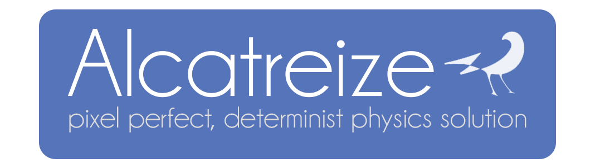

---

A custom, deterministic, physics library, with pixel perfection in mind. Designed to be used in the Godot engine. Many game who need rollback netcode or pixel snapping should be interested in this project.
It only work for C# but a C++ module is planned, which would allow cleaner internal Nodes & GDScript support. Note that Alcatreize is still actively in development and is not yet suitable for production

:bangbang: work only in Godot Mono :bangbang:

## Before starting & limitations

Alcatreize is designed toward Pixel Art game. Every position of any given Entity need and will be in pixel, integers coordinate.
So this is not really suitable for anything else that pixel art games. \
For the moment only **A**xis **A**ligned **B**ounding **B**ox are allowed as collisions shapes, note that this may change in the future.
Beside pixel perfection, Alcatreize is 100% determinist, which made it a good choice for game necessitating Rollback Netcode

## How does it work

Alcatreize classifies entities in two groups (static level geometries are not considered as entity). \
But first, what is an Entity ?

> An entity is an object who can regroup boxes (= pushboxes, hitboxes etc...) and move in the scene

As said earlier, their are 2 groups of entities :

| Entity | Description |
| ------------- | ------------- |
| **Actors** | They move move in the scene while taking care to **not** overlap any colliders in their path |
| **Solids** | They move freely in the scene without taking care of any collisions, their only interactions is to push any Actors in their path |

Now these entities work better when they are assigned boxes. \
Every entity will register all boxes who is a direct child of itself. Actually you can use 3 different boxes:

| Box | Usage |
| ------------- | ------------- |
| **Pushbox**  | Act as a collision shape for an entity. Can be set as "static" in order to increase performance
| **Hitbox**   | A rectangle with a `Tick();` function that will call `Ticked ();` on every hurtbox overlapping this hitbox.   |
| **Hurtbox**  | A rectangle with no function. Consist of a `Ticked ();` Godot Signal called when this box is ticked by a Hitbox |

> Also note that these boxes can be used standalone, they don't need an entity to work !

## Usage

#### Importing Alcatreize into Godot
You need to use the **mono** version of Godot, as Alcatreize is written in C#. \
Alcatreize will only work with C#, as inheriting is mandatory (Althought you could do some glue code to limit the c# usage) \
The final goal would be to convert this to an internal C++ Godot Module

Simply drag & drop the "alcatreize" folder of the main branch anywhere in your Godot Project.
> NOTE: Drag & Dropping won't create a project solution, if you did not create at least 1 C# script before, create an empty one from Godot to initialize the solution
#### Using it

TODO

#### The demo 
You can find a demo of Alcatreize [here](https://github.com/Carbone13/alcatreize-examples)

## Okay, but why not just using the default Godot physics ?

Godot physics are not pixel-perfect by default. A pixel-perfect behaviour can still be reproduced but their is a second point : **DETERMINISM** \
A determinist physics is a system where rolling back to a state, and doing the exact same things will result in the exact same result.
This don't happens when using the Godot physics as rolling back and re-simulating the physics frame is not possible. Also the use of floats break the determinism, especially when targeting different platforms

## About Performances

To this day, no benchmark has been done. Every boxes are optimized by using a Spatial Hash Grid, which speed up the broadphase

## Used Technologies & Credits

Alcatreize is using soft float in order to achieve its determinism.
The soft floats are based on [this repository](https://github.com/Kimbatt/soft-float-starter-pack), it is contained in the alcatreize/maths folders (except the sfloat2 which is a simple Vector2 struct where floats have been replaced with sfloats)

The colliders query broadphase is done using [SuperGrid2D](https://github.com/bartofzo/SuperGrid2D)

The main logic for Actor & Solid follow [this article](https://medium.com/@MattThorson/celeste-and-towerfall-physics-d24bd2ae0fc5) by Maddy Thorson \
Everything else is done by Carbone13 (Lucas Michaudel)

## License(s)

---
Alcatreize is published under the MIT License, but SuperGrid and Soft Floats SP both have their respective licenses that must be respected
